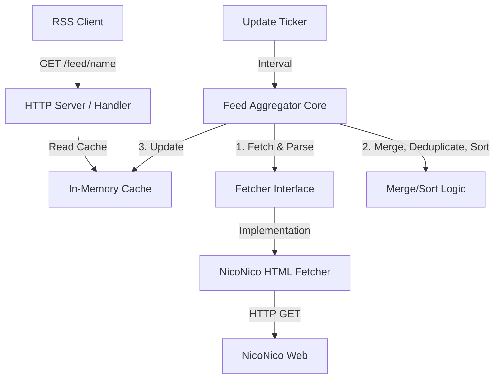

# Agent Guidance (`AGENTS.md`)

このドキュメントは、本プロジェクト（`nicovideo_tag_rss`）を開発するAIエージェントのための開発方針およびガイドラインです。開発を進める際は、常にこの方針に従ってください。

---

## 1. 開発プロセス

開発は**チケット（Issue）駆動**および**テスト駆動開発（TDD）**を徹底します。

### 不明点の確認とドキュメント更新
- **実装前・実装中に不明点が生じた場合**は、推測で進めず**必ずユーザに確認**してください。
- 確認によって仕様が決定した場合は、**速やかに本ドキュメント（`AGENTS.md`）を更新**し、決定した仕様を反映してください。
- 仕様が曖昧なまま実装を進めることは避けてください。

### チケット駆動開発 (Issue-Driven)
1. **タスクの分解とIssue起票**:
   - 実装を行う前に、タスクを論理的な単位に分解します。
   - GitHub CLI (`gh` コマンド) を使用して Issue を起票します。
   - **[必須] Issue記載**: `.github/ISSUE_TEMPLATE/task.md` のフォーマットに従って記載してください。
2. **フィーチャーブランチの作成**:
   - 各Issueに対して、ブランチ `feature/issue-<ID>-<short-description>` を作成して作業します。
3. **Pull Requestの作成とセルフレビュー・マージ**:
   - 実装完了後、必ずローカルでテスト（`go test ./...`）を実行・パスすることを確認してからPRを作成します。
   - **[必須] PR記載**: `.github/PULL_REQUEST_TEMPLATE.md` のフォーマットに従って記載してください。PRタイトルは `feat: 〇〇の実装`, `fix: 〇〇の修正`, `docs: 〇〇の更新` などを推奨します。
   - **[注意]** PR本文の `Fixes #<番号>` には、起票したIssueの正確な番号を記載してください。番号が誤るとGitHubの自動クローズが機能しません。Issue起票直後に `gh issue list` で番号を確認することを推奨します。
   - 作成後、エージェント自身が要件を満たしているかセルフレビューを行います。
   - **[必須] レビュー時のコメント**:
     PRテンプレート内の「セルフレビュー用チェックリスト」の項目がすべて満たされていることを確認した上で、`gh pr review --comment` により「セルフレビュー完了」の旨と確認結果を記録してください。
   - レビューの結果、問題がなければメインブランチへマージ (`gh pr merge --merge --delete-branch`) します。


### テスト駆動開発 (TDD)
1. **テストを先に書く**:
   - 特にビジネスロジックやパース処理など、入力と出力が明確なモジュールについては、実装コードを書く前にテストコード（`*_test.go`）を作成します。
2. **モックの活用とデータ取得スクリプト**:
   - ニコニコ動画のHTMLパース処理のテストには、実際のネットワークアクセスを行わず、ローカルに保存したHTMLモックデータ（テスト用HTMLファイル）を読み込ませて検証します。
   - テストや動作確認用のHTMLデータ取得＋チェック用スクリプトを別途実装し、ローカルに保存された生HTMLファイルなどは `.gitignore` に追加してコミット対象外（git無視）とします。
3. **リファクタリング**:
   - テストが通る最小限の実装を行った後、コードの品質を向上させるためのリファクタリングを行います。リファクタリング後もテストが通ることを保証します。


### テスト戦略と品質ゲート
- **単体テスト**:
  - ビジネスロジック、設定のバリデーション、キャッシュ、RSS 生成、HTML パースは、入力・出力を明示した `*_test.go` で検証します。
  - 正常系だけでなく、空入力、重複、境界値、失敗時に既存キャッシュを維持することを検証します。
  - 各モジュールは**間接テスト（上位層経由）だけでなく直接ユニットテスト**も追加します。例えば `GenerateRSS` は `aggregator` 経由だけでなく `feed/rss_test.go` として単体で検証します。
- **HTTP ハンドラーのテスト**:
  - `httptest` を使い、ステータスコード、レスポンス形式、ETag を含む主要な HTTP の振る舞いを検証します。
  - `handleIndex` のような catch-all ハンドラーでは、**登録済みパス・未登録パス・設定が nil の場合**の全分岐を検証します。
- **外部通信の扱い**:
  - 通常の自動テストはネットワークに依存させません。ニコニコ動画の検索結果はローカルの HTML フィクスチャで検証し、HTTP クライアントはモックまたはテスト用 Transport に差し替えます。
  - 実サイトへのアクセスは、必要な場合だけ開発者が明示的に実行する確認用スクリプトで行います。
- **`MockRoundTripper` の正しい使い方** (`nico/fetcher_test.go` 内):
  - `failTimes` を設定しない（または `0`）の場合、最初のリクエストから即 200 を返します。
  - **特定のステータスコードを確実に返したい場合は `failTimes: 10` など大きな値を設定**します（`callCount <= failTimes` の間は `statusCode` を返し、それ以降は 200 を返す実装のため）。
  - 4xx (例: 404, 403) は `RetryableClient` がリトライしないため、`failTimes: 10` を設定すると常に1回で終了し指定のステータスが返ります。
  - 5xx はリトライ対象なので、最終的に 200 を返させたい場合は `failTimes` でリトライ回数を制御します。
- **`RetryableClient` のリトライ仕様とテスト**:
  - ネットワークエラー・5xx のみリトライ対象、**4xx は非リトライ**であることをテストで明示します。
  - 最大5回試行（初回 + 4リトライ）を超えた場合はエラーを返すことを確認します。
  - 連続リクエスト間の最低1秒インターバルも検証します。
- **`parseHTML` のエラーケース**:
  - `meta[name='server-response']` タグが存在しない HTML → エラーを返すこと
  - `content` 属性の JSON が不正 → `"failed to parse json"` を含むエラーを返すこと
  - `registeredAt` が不正な日時フォーマット → `time.Now()` にフォールバックすること（`PubDate` が1分以内であることで検証）
- **`CleanExpired` の境界値**:
  - `retentionDays=0` の場合、`cutoff ≈ now` となり今日投稿の動画も含め全動画が削除されます。この仕様をテストで固定します。
  - 存在しない feed 名を指定してもパニックしないことを確認します。
- **`config` のデフォルト値とフォールバック**:
  - `update_interval` が 60m 未満 → 60m にクランプ（境界値 59m / 60m / 120m を含む）
  - `video_retention_days <= 0` → 7 にフォールバック
  - `max_pages <= 0` → 1 にフォールバック
  - これらは**回帰テスト**として `config/regression_test.go` に固定します。
- **Aggregator の回帰テスト**:
  - 複数 sorts × 複数 tags の全組み合わせで `FetchByTag` が呼ばれること（外側ループ: sorts、内側ループ: tags）
  - 複数 sorts から同一 ID の動画が返った場合に重複排除され1件になること
  - フェッチエラー時に ETag を含む既存キャッシュが完全に保持されること
- **回帰テストの配置**:
  - 既知の境界条件・不具合の再発防止テストは `*_test.go` に混在させず、各パッケージに `regression_test.go` として分離します。意図が分かる命名（例: `TestLoadConfig_UpdateIntervalMinEnforced`）を付けます。
- **CI の必須品質チェック**:
  - CI では `go build ./...`、`go vet ./...`、`go test -race`、`gofmt`、固定版 Staticcheck を実行します。
  - Docker イメージの build/push は、テストと Staticcheck の両方が成功した場合にだけ実行します。
- **カバレッジ方針**:
  - CI では `-covermode=atomic` と `-coverpkg=./...` を使ってカバレッジを計測し、ジョブサマリーに表示します。
  - カバレッジ率そのものを CI の失敗条件にはしません。重要な分岐、エラー処理、変更箇所にテストがあるかを確認し、未テスト領域の発見と改善の優先順位付けに利用します。


---

## 2. 設計方針

ニコニコ動画の仕様変更（HTML構造の変更など）に対して強い耐性を持つ設計（疎結合）を目指します。



### 依存関係の逆転 (Dependency Inversion)
- **Fetcherの抽象化**:
  ニコニコ動画から動画情報を取得する処理は、インターフェース（例: `VideoFetcher`）を介して呼び出します。
  ```go
  type Video struct {
      ID          string    // smxxxx, soxxxx など
      Title       string
      Link        string
      Description string
      PubDate     time.Time
      Thumbnail   string
      Author      string
  }

  type VideoFetcher interface {
      FetchByTag(ctx context.Context, tag string) ([]Video, error)
  }
  ```
  これにより、将来的にニコニコ動画がAPIを公開した場合や、HTMLの構造が変わりパーサーの実装を変更する場合でも、`VideoFetcher` を実装する具象クラスを変更するだけで、コアロジック（マージ、ソート、キャッシュ、HTTPサーバー）には一切影響を与えません。

### 堅牢なエラーハンドリングとリトライ
- **一時的障害への耐性**:
  特定のタグの取得に失敗した場合でも、システム全体をクラッシュさせたり、古いキャッシュをクリアしたりせず、エラーログ（`log/slog` による構造化ログ）を出力して**前回の正常なキャッシュを保持**します。
- **HTTPリトライ機構**:
  - **対象エラー**: ネットワークエラー、5xxサーバーエラー、パース失敗
  - **リトライ方式**: 指数バックオフ（1s → 2s → 4s → 8s → 16s）
  - **最大リトライ回数**: 4回（合計5回のリクエスト試行）
  - **レート制限**: すべての連続リクエスト間に最低1秒の間隔を設定
  - **実装**: 標準ライブラリのみ使用、`http.Client` をラップした `RetryableClient` で実装
- **上位レベルのリトライ**:
  失敗したタグは、次回の `update_interval` 到着時に再度取得を試みます。

### キャッシュの永続化
- **目的**: アプリケーションの再起動時にキャッシュを失わないようにするため、インメモリキャッシュをディスクに定期的に保存（JSON形式）します。
- **実装方式**: 
  - 起動時に `cache_dir` 配下の `cache.json` から復元
  - 各フィード更新後に自動保存（更新時に同時実行）
  - グレースフルシャットダウン時に最終キャッシュを保存
- **フォーマット**: JSON形式で、`map[string]*CachedFeed` をシリアライズします。構造は以下の通り：
  ```json
  {
    "feed_name": {
      "videos": [...],
      "rss_xml": "...",
      "last_updated": "2026-07-08T...",
      "etag": "..."
    }
  }
  ```
- **ビデオ保持期間**: 
  - デフォルト：7日間
  - 設定ファイルで `video_retention_days` で指定可能（無効な値は7日にフォールバック）
  - 各フィード更新後、`PubDate` が保持期間より古いビデオを自動削除
- **互換性とスキーマ変更方針**:
  - バージョンアップ等によりデータ構造やキャッシュスキーマが変更された場合、古いデータ構造からの移行処理は行いません。
  - ロードされたキャッシュデータに必要な要素が不足している（最新のスキーマに適合しない）場合、またはファイルのロードに失敗した場合は、その古いキャッシュデータを破棄（削除）し、次回のバックグラウンド更新処理で再生成します。これにより、移行用コードの複雑化を防ぎ、キャッシュ構造を常にクリーンに保ちます。

### ページネーション
- **目的**: 更新間隔が長い、または投稿数が多いタグの場合、複数ページの検索結果を取得して、より多くのビデオをキャッチできるようにします。
- **設定**: `config.yaml` で `max_pages` を指定（デフォルト `1` ページ）
- **実装**:
  - `FetchByTag()` で各ページ（1, 2, 3, ...）を順序付けて取得
  - ページ URL パラメータ: `?sort=registeredAt&order=desc&page=N`
  - 空のページを検出すると取得を停止（無駄なリクエスト削減）
  - すべてのページのビデオを結合（重複除去は aggregator で処理）
- **デフォルト**: `max_pages=1`（ページングなし、従来通り）

---

## 3. 技術スタック

- **言語**: Go 1.26+
  - 標準ライブラリの `net/http` （Go 1.22でルーティングが強化されたため、標準ライブラリを優先して使用）
  - 構造化ログには標準の `log/slog` を使用
- **サードパーティ・ライブラリ**:
  - ライブラリを選定する際は、GitHub Star数やメンテナンス頻度が高く、更新が途絶えるリスクが低い「人気のあるもの」を採用します。
  - YAML解析: `gopkg.in/yaml.v3`
  - HTMLパース: `github.com/PuerkitoBio/goquery` (あるいは `golang.org/x/net/html`)
  - RSS生成: `github.com/gorilla/feeds`

- **Docker**:
  - `distroless` または `alpine` をベースとしたマルチステージビルドによる軽量な本番用イメージ。

---

## 4. ディレクトリ構成案

```text
.
├── README.md
├── AGENTS.md            # 本ドキュメント
├── go.mod
├── go.sum
├── main.go              # エントリーポイント、初期化、サーバー起動
├── config/              # 設定ファイルのパースロジック
│   ├── config.go
│   ├── config_test.go
│   └── regression_test.go  # 境界値・デフォルト値の回帰テスト
├── nico/                # ニコニコ動画のデータ取得・パース
│   ├── fetcher.go       # VideoFetcher インターフェースと具象実装
│   ├── fetcher_test.go  # テストコード
│   └── testdata/        # テスト用のニコニコ動画HTMLモック
├── feed/                # キャッシュ、マージ、重複排除、RSS生成
│   ├── aggregator.go
│   ├── aggregator_test.go
│   ├── cache.go
│   ├── cache_test.go
│   ├── regression_test.go  # Aggregator・Cache の回帰テスト
│   ├── rss.go
│   └── rss_test.go      # GenerateRSS の直接ユニットテスト
└── server/              # HTTP ハンドラー
    ├── handler.go
    └── handler_test.go
```

---

## 5. ログ設計

`log/slog` を使用し、JSONまたは構造化テキスト形式で出力します。

- **INFO**:
  - アプリケーション起動時（設定情報、Listenアドレスなど）
  - 定期更新の開始 (`feed_name` 単位、開始時刻)
  - タグごとの取得成功 (`tag`, `count`, `duration`)
  - フィードの更新完了 (`feed_name`, `merged_count`, `duration`)
- **ERROR**:
  - 設定ファイル読み込み失敗
  - タグ取得失敗（ネットワークエラー、ステータスコード異常など。`tag`, `error`）
  - HTMLパース失敗（`tag`, `error`）
  - RSS生成失敗（`feed_name`, `error`）
