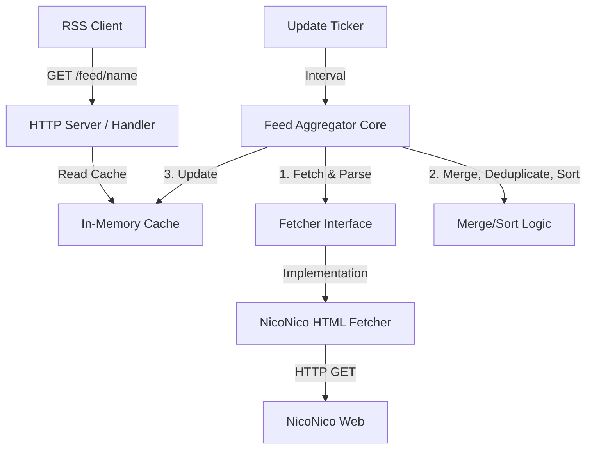

# Agent Guidance (`agent.md`)

このドキュメントは、本プロジェクト（`nicovideo_tag_rss`）を開発するAIエージェントのための開発方針およびガイドラインです。開発を進める際は、常にこの方針に従ってください。

---

## 1. 開発プロセス

開発は**チケット（Issue）駆動**および**テスト駆動開発（TDD）**を徹底します。

### チケット駆動開発 (Issue-Driven)
1. **タスクの分解とIssue起票**:
   - 実装を行う前に、タスクを論理的な単位（例: 「YAML設定ファイルの読み込み実装」「ニコニコ動画HTMLパーサーの実装」「RSS生成ロジックの実装」など）に分解します。
   - GitHub CLI (`gh` コマンド) を使用して、実際に GitHub リポジトリ上に Issue を起票します。
2. **フィーチャーブランチの作成**:
   - 各Issueに対して、ブランチ `feature/issue-<ID>-<short-description>` を作成して作業します。
3. **Pull Requestの作成とセルフレビュー・マージ**:
   - 実装が完了したら、**必ず事前にローカルでテスト（`go test ./...`）を実行し、すべてパスすることを確認**してから GitHub CLI を用いて Pull Request を作成します。
   - 作成後、エージェント自身が要件を満たしているかセルフレビュー（必要に応じてサブエージェントを活用）を行います。
   - **[必須]** レビュー時には必ずPRに対してコメント (`gh pr review --comment` または `gh pr comment`) を記載してレビュー記録を残してください。以下の観点で評価を行います。
     - **TDDとテスト網羅性**: ロジックに対するテストが実装されており、異常系を含めて網羅されているか。
     - **コード品質とエラーハンドリング**: パニックせず適切にエラーを返し、構造化ログが仕様通りに出力されているか。
     - **設計方針への準拠**: インターフェースによる疎結合や依存関係の逆転など、本ドキュメントの設計方針に従っているか。
   - レビューの結果、問題がなければ、エージェント自身でメインブランチへマージ (`gh pr merge`) し、作業ブランチを削除します。


### テスト駆動開発 (TDD)
1. **テストを先に書く**:
   - 特にビジネスロジックやパース処理など、入力と出力が明確なモジュールについては、実装コードを書く前にテストコード（`*_test.go`）を作成します。
2. **モックの活用とデータ取得スクリプト**:
   - ニコニコ動画のHTMLパース処理のテストには、実際のネットワークアクセスを行わず、ローカルに保存したHTMLモックデータ（テスト用HTMLファイル）を読み込ませて検証します。
   - テストや動作確認用のHTMLデータ取得＋チェック用スクリプトを別途実装し、ローカルに保存された生HTMLファイルなどは `.gitignore` に追加してコミット対象外（git無視）とします。
3. **リファクタリング**:
   - テストが通る最小限の実装を行った後、コードの品質を向上させるためのリファクタリングを行います。リファクタリング後もテストが通ることを保証します。


---

## 2. 設計方針

ニコニコ動画の仕様変更（HTML構造の変更など）に対して強い耐性を持つ設計（疎結合）を目指します。



### 依存関係の逆転 (Dependency Inversion)
- **Fetcherの抽象化**:
  ニコニコ動画から動画情報を取得する処理は、インターフェース（例: `VideoFetcher`）を介して呼び出します。
  ```go
  type Video struct {
      ID          string    // smxxxx, soxxxx など
      Title       string
      Link        string
      Description string
      PubDate     time.Time
      Thumbnail   string
      Author      string
  }

  type VideoFetcher interface {
      FetchByTag(ctx context.Context, tag string) ([]Video, error)
  }
  ```
  これにより、将来的にニコニコ動画がAPIを公開した場合や、HTMLの構造が変わりパーサーの実装を変更する場合でも、`VideoFetcher` を実装する具象クラスを変更するだけで、コアロジック（マージ、ソート、キャッシュ、HTTPサーバー）には一切影響を与えません。

### 堅牢なエラーハンドリング
- **一時的障害への耐性**:
  特定のタグの取得に失敗した場合でも、システム全体をクラッシュさせたり、古いキャッシュをクリアしたりせず、エラーログ（`log/slog` による構造化ログ）を出力して**前回の正常なキャッシュを保持**します。
- **リトライ**:
  失敗したタグは、次回の `update_interval` 到着時に再度取得を試みます。

---

## 3. 技術スタック

- **言語**: Go 1.22+
  - 標準ライブラリの `net/http` （Go 1.22でルーティングが強化されたため、標準ライブラリを優先して使用）
  - 構造化ログには標準の `log/slog` を使用
- **サードパーティ・ライブラリ**:
  - ライブラリを選定する際は、GitHub Star数やメンテナンス頻度が高く、更新が途絶えるリスクが低い「人気のあるもの」を採用します。
  - YAML解析: `gopkg.in/yaml.v3`
  - HTMLパース: `github.com/PuerkitoBio/goquery` (あるいは `golang.org/x/net/html`)
  - RSS生成: `github.com/gorilla/feeds`

- **Docker**:
  - `distroless` または `alpine` をベースとしたマルチステージビルドによる軽量な本番用イメージ。

---

## 4. ディレクトリ構成案

```text
.
├── README.md
├── agent.md             # 本ドキュメント
├── go.mod
├── go.sum
├── main.go              # エントリーポイント、初期化、サーバー起動
├── config/              # 設定ファイルのパースロジック
│   ├── config.go
│   └── config_test.go
├── nico/                # ニコニコ動画のデータ取得・パース
│   ├── fetcher.go       # VideoFetcher インターフェースと具象実装
│   ├── fetcher_test.go  # テストコード
│   └── testdata/        # テスト用のニコニコ動画HTMLモック
├── feed/                # キャッシュ、マージ、重複排除、RSS生成
│   ├── aggregator.go
│   ├── aggregator_test.go
│   ├── cache.go
│   └── cache_test.go
└── server/              # HTTP ハンドラー
    ├── handler.go
    └── handler_test.go
```

---

## 5. ログ設計

`log/slog` を使用し、JSONまたは構造化テキスト形式で出力します。

- **INFO**:
  - アプリケーション起動時（設定情報、Listenアドレスなど）
  - 定期更新の開始 (`feed_name` 単位、開始時刻)
  - タグごとの取得成功 (`tag`, `count`, `duration`)
  - フィードの更新完了 (`feed_name`, `merged_count`, `duration`)
- **ERROR**:
  - 設定ファイル読み込み失敗
  - タグ取得失敗（ネットワークエラー、ステータスコード異常など。`tag`, `error`）
  - HTMLパース失敗（`tag`, `error`）
  - RSS生成失敗（`feed_name`, `error`）
